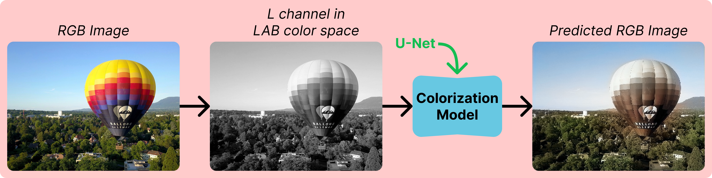

# 🎨 Image Colorization with U-Net

This project implements an image colorization model using the U-Net++ architecture with an EfficientNet-B3 backbone.
The model works in the LAB color space 🌈, where the L channel (grayscale) is used as input, and the model learns to predict the A and B color channels, which are then combined with the L channel to reconstruct a full-color RGB image.



## 🔧 Setup

1. Clone the Repository:
```bash
git clone https://github.com/massimilianoviola/image-colorization-unet.git
cd image-colorization-unet
```

2. Create an environment and install dependencies:
```bash
conda create -n image-colorization python==3.12 -y
conda activate image-colorization
pip install -r requirements.txt
```

3. Download training data:
```bash
./data/download_data.sh
```

The script will download the following datasets and place them into the `data/` folder:
- DIV2K (Train + Validation): 900 high-resolution images
- BSDS500 Dataset: 500 natural images
- Stanford Background Dataset: 715 outdoor images

The model is trained on a very small dataset. For significantly better performance and generalization, consider expanding the dataset with a more diverse collection.

## 🏋️‍♂️ Training

1. Adjust parameters in `src/config.yaml` like batch size, learning rate, and epochs if needed.
2. Run training:
```bash
python src/train.py
```

The training script will:
- Save model checkpoints to `checkpoints/`
- Save progress images to `progress/`
- Save the best model based on validation loss

## 🧪 Testing

Run inference on test images in `data/test_images/`:
```bash
python src/test.py
```

The test script will:
- Automatically find and load the best model
- Convert the test images to grayscale and do inference, preserving the original image resolution
- Save colorized outputs to `colorized_outputs/`

## ⚙️ Configuration

Key parameters in `src/config.yaml` that can be adjusted based on your hardware capabilities and requirements are:
```yaml
model:
  arch: UnetPlusPlus
  encoder_name: efficientnet-b3
  encoder_weights: imagenet

data:
  crop:
    height: 320
    width: 320
  batch_size: 24
  num_workers: 8

training:
  num_epochs: 50
  learning_rate: 0.0025
```
The code was tested on an NVIDIA Tesla T4 GPU.